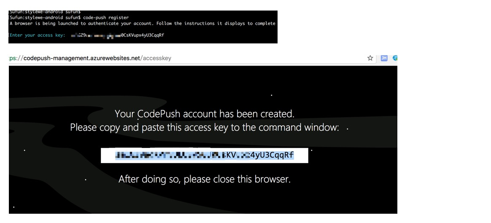

CodePush是用于ReactNative的js代码同步的一个服务，公司现在使用的是微软的一个服务。[官方网站](https://microsoft.github.io/code-push/) 
===================
Documents
-------------

>**使用步骤**
  > - 注册CodePush 帐号 
  > - 创建App
   > - 配置As的相关代码
  > - 配置js的启动代码
 > - 生成assets文件
  > - 生成Bundle文件
> - 将打包文件上传到CodePush服务器
> - 常用的code-push命令

>**注册CodePush:**
  > - step1： code-push register 
  > - 浏览器自动打开，使用github授权，得到accesskey
  > - step2: 输入codepush access-key
 操作流程如下所示：

 > **创建App:**
    > - step1:  code-push app add stylewe-test
    > - 执行结果如下所示，记得要保存好相关的Deployment Key

配置手机端相关的代码

> - step1: 导入code-push的依赖包，package.json如所下所示：
   
   
    {
	  "name": "example-android",
	  "version": "1.50.00",
	  "description": "example test",
	  "main": "index.js",
	  "scripts": {
	    "start": "node node_modules/react-native/local-cli/cli.js start",
	    "bundle": "node node_modules/react-native/local-cli/cli.js bundle"
	  },
	  "repository": {
	    "type": "git",
	    "url": "git@git.exam.com:exampla-android"
	  },
	  "author": "",
	  "license": "ISC",
	  "dependencies": {
	    "immutable": "^3.8.1",
	    "native-base": "2.1.1",
	    "react": "16.0.0-alpha.6",
	    "react-native": "0.43.3",
	    "react-native-code-push": "2.0.2-beta",
	    "react-native-localization": "^0.1.30",
	    "react-native-router-flux": "^3.38.1",
	    "react-native-svg": "4.5.0",
	    "react-native-svg-uri": "1.2.0",
	    "react-navigation": "^1.0.0-beta.9",
	    "react-redux": "^5.0.4",
	    "redux": "^3.6.0"
	  }
	}
	
	
> - step2: 在项目的根目录下面执行---> npm install 
     
     
> - step3: 在AndroidStudio里面进行code push 的引用配置
     
     
     /setting.gradle 加入
     include ':react-native-code-push'
     project(':react-native-code-push').projectDir = new File(rootProject.projectDir, '/node_modules/react-native-code-push/android/app')
     /app/build.gradle
     android{
       dependencies{
       	//
       	compile project(':react-native-code-push')
       	...others 
       }
       buildTyes{
       	 release{
			buildConfigField "String", "CODEPUSH_KEY", '"[生产环境使用的codepush key]"'
       	 }
       	 debug{
			buildConfigField "String", "CODEPUSH_KEY", '"[生产环境使用的codepush key]"'
       	 }
       }
     }
     
     
> - step4: 执行gradle
     
     
> - step5: Application中进行配置
     
     
          ExampleApplication.onCreate(){
          	CodePush.setReactInstanceHolder(mReactNativeHost);
          }

              //Reactive Native CodePush
	    private final MyReactNativeHost mReactNativeHost = new MyReactNativeHost(this);
	    public class MyReactNativeHost extends ReactNativeHost implements ReactInstanceHolder{

        XKCommomViewPackage mXKPackage;
        protected MyReactNativeHost(Application application) {
            super(application);
        }

        @Override
        protected String getJSBundleFile() {
            return CodePush.getJSBundleFile();
        }

        @Override
        public boolean getUseDeveloperSupport() {
            return BuildConfig.DEBUG;
        }

        @Override
        protected List<ReactPackage> getPackages() {
            // 3. Instantiate an instance of the CodePush runtime and add it to the list of
            // existing packages, specifying the right deployment key. If you don't already
            // have it, you can run "code-push deployment ls <appName> -k" to retrieve your key.
            mXKPackage=new XKCommomViewPackage();
            return Arrays.<ReactPackage>asList(
                    new MainReactPackage(),
                    new CodePush(BuildConfig.CODEPUSH_KEY, ExampleApplication.this,BuildConfig.DEBUG),  // , //BuildConfig.DEBUG

            );
        }

        /**
         * 中间通信层
         * @return
         */
        public XKCommomViewPackage getXKPackage()
        {
            return mXKPackage;
        }
    }

    @Override
    public ReactNativeHost getReactNativeHost() {
        return mReactNativeHost;
    }

    public MyReactNativeHost getMyReactNativeHost()
    {
        return mReactNativeHost;
    }

> **配置js的启动代码:**

> - step1: 在你的入口js文件中，配置如下代码
  
  import codePush from 'react-native-code-push';
  class App extends Component{
     constructor()
     {
       super()
       /**
       *关于这个同步的方式有多种，
       *可具体参考业务要求https://microsoft.github.io/code-push/docs/tutorials.html
       ***/
       codePush.sync({installMode:codePush.InstallMode.IMMEDIATE});
 	 }
  }

 > **生成assets文件：**
 
 > - step1: 将js文件编译后存放在android 应用的assets中，而后将其打包放入apk中。./export-bundle-to-assets.sh
  
	echo “ok ,starting to building bundle js”
	Cur_Dir=$(pwd)
	echo $Cur_Dir
	react-native bundle --platform android --dev false --entry-file index.android.js --bundle-output $Cur_Dir/app/src/main/assets/index.android.bundle --assets-dest $Cur_Dir/app/src/main/res
	echo “ok ,bundle.js file build finished  sufun”
			
			
> - step2: 生成需要同步到codepush服务器的bundle文件   ./export-bundle-to-bundles.sh
  
	  #!/bin/bash
	echo “start to export the bundles for the code push“
	react-native bundle --platform android --entry-file index.android.js --bundle-output ./bundles/index.android.bundle --dev false	
			
> - step2: 将新生成文件上传到服务器上
  
      code-push release app-test ./bundles/index.android.bundle 1.5.0  -d Staging --des "1.50.01 debug-静默用户更新与立即安装-print-headers.value " -r 100

> **这个命令需要在这边解释一下：**

> - app-test :指的是，您在服务器上面当时增加的应用名称，还记得code-push app add [应用名么]  ？也可以查看一下现在服务器上面的应用列表
       
       
> - 1.5.0 :这个是对应应用的版本号，这块有个问题，就是他只识别[].[].[] 不能使用1.50.00类似的这样的版本格式，并且这边对应的android/app/build.gradle中,只有这两个对应上了，才能达到效果。
       
       
       android{
       	defaultConfig{
       		versionName "[版本名称]"
       	}
       }
    
    
> -  Staging: 指的是发布开发版本，但如果说是你要发到正式服上面的话，则使用 Production 	
      
      
> - --des: 后面则是为这个版本增加一些描述
     
     
> -  -r:    可以用于切量，0-100 ，用于做流量的分发。
      
      
 > **常用code-push命令：** 
 > - 查看应用列表：code-push app list
    
 > -  查看版本更新列表以及当前安装的人数：
    
     code-push deployment history stylewe-test Production
     code-push deployment history stylewe-test Staging
     
 > - 其它的更多命令可参考官网： 
    
    

     

